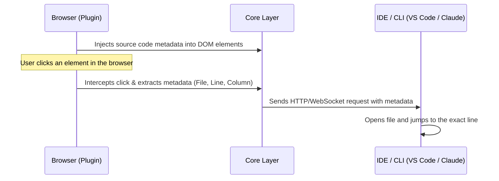

# Contributing to Inspecto

Thanks for your interest in contributing! Before you start, please take a moment to review our [Code of Conduct](CODE_OF_CONDUCT.md).

## Project Structure

This is a monorepo managed by pnpm workspaces and turborepo.

- `packages/core`: Core logic for communication between the browser and IDE/CLI.
- `packages/plugin`: The unplugin (Vite, Webpack, Rspack, Rollup) that injects source code location metadata into the DOM.
- `packages/ide`: The VS Code extension that handles the background server and IDE actions.
- `packages/types`: Shared TypeScript definitions.
- `playground/`: Various example projects (React, Vue, Next.js, etc.) used for testing.

## Architecture & How It Works

Understanding how Inspecto works will help you make contributions more easily. Here is a high-level overview of how the browser communicates with the IDE via the core layer.

1. **Plugin Injection**: The build plugins (`packages/plugin`) analyze your code during compilation and attach file location metadata (like file path, line, and column) directly to DOM elements.
2. **Event Interception**: When you activate Inspecto in the browser, `packages/core` takes over and listens to user clicks. It reads the metadata attached by the plugin.
3. **Communication**: `packages/core` then triggers an HTTP request or WebSocket message to the local server running in the IDE (handled by `packages/ide`).
4. **Action**: The IDE receives the file location and automatically opens the file and cursor position, allowing seamless navigation or invoking AI target tools (like Cursor, Claude Code, etc.).

## 🐣 Good First Issues & Help Wanted

If you are new to the project and want to contribute, looking for specific labels in our Issue Tracker is a great way to start!

- **`good first issue`**: These issues are scoped and well-documented. They are relatively simple, require minimal context of the entire architecture, and are ideal for first-time contributors.
- **`help wanted`**: These issues are open for anyone to pick up. We may need extra hands to implement a feature, test a specific framework, or write documentation.

If you decide to work on an issue, please comment on it so others know someone is already tackling it! If you get stuck, feel free to ask questions in the issue thread.

## Development Setup

1. Clone the repository
2. Run `pnpm install`
3. Run `pnpm dev` to start building packages in watch mode
4. Open another terminal and run `cd playground/react-vite && pnpm dev` (or `cd playground/vue-vite && pnpm dev`) to test your changes

## Pull Requests

1. Create a branch for your feature/fix (e.g. `feat/add-new-target` or `fix/webpack-hmr`)
2. Follow [Conventional Commits](https://www.conventionalcommits.org/) for your commit messages (e.g., `feat: add new CLI target`, `fix: resolve crash on mount`).
3. Ensure `pnpm test` and `pnpm typecheck` pass
4. Add a changeset if your PR affects published packages: `pnpm changeset`
5. Submit your PR! Please provide a clear description of the problem and your solution, and follow the PR template.
