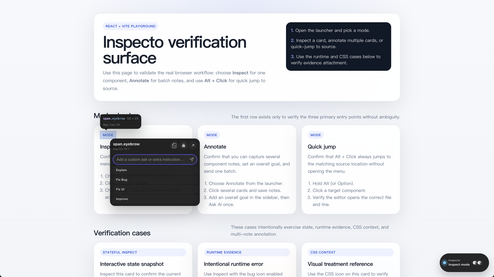
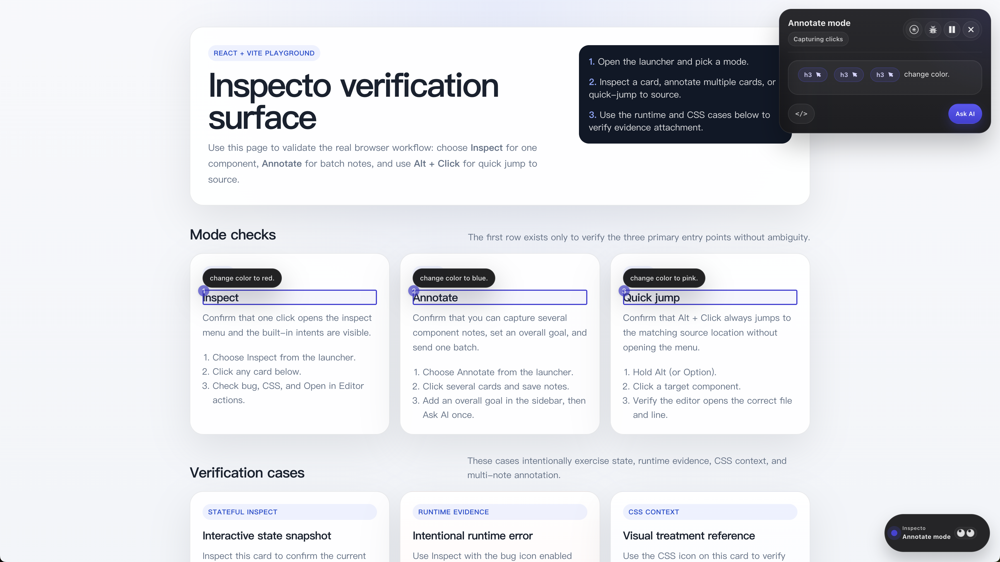
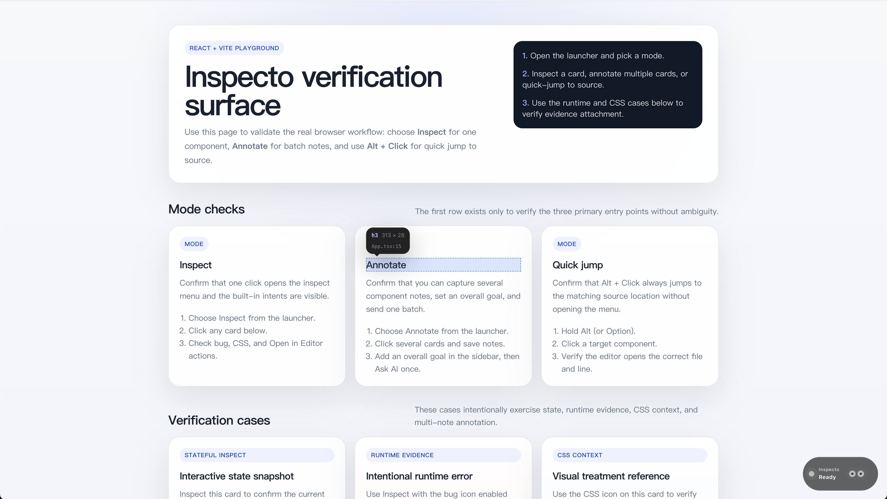

# Inspecto

[English](./README.md) | 简体中文

[](https://www.npmjs.com/package/@inspecto-dev/plugin)
[](https://www.npmjs.com/package/@inspecto-dev/core)
[](https://www.npmjs.com/package/@inspecto-dev/cli)
[](https://opensource.org/licenses/MIT)

> 告别浏览器、DevTools、编辑器与 AI Assistant 之间的繁琐切换。
> Inspecto 缩短了整个链路：直接从网页开始，顺滑无缝地把准确的上下文交给源码或 AI。

👉 **[前往 inspecto-dev.github.io/inspecto 阅读完整文档](https://inspecto-dev.github.io/inspecto/zh/)**

<p align="center">
  
</p>

## 核心工作流

<p align="center">
  
  
  
</p>

- `Inspect mode`：点击单个组件，立即 Ask AI
- `Annotate mode`：跨多个组件记录 note，最后一次发送
- `Quick jump`：用 `Alt` + `点击` 直接打开准确的源码位置

## 快速开始

最快的使用方式是为你喜欢的 AI 助手安装对应的引导集成。

1. **进入你的项目根目录**。
2. **复制并运行匹配的安装命令**：

   `--host-ide` 的可选值包括：`vscode`, `cursor`, `trae`, `trae-cn`。

   ```bash
   # VS Code + Copilot
   npx @inspecto-dev/cli integrations install copilot --host-ide vscode

   # VS Code + Codex
   npx @inspecto-dev/cli integrations install codex --host-ide vscode

   # VS Code + Claude Code
   npx @inspecto-dev/cli integrations install claude-code --scope project --host-ide vscode

   # Cursor builtin
   npx @inspecto-dev/cli integrations install cursor --host-ide cursor

   # VS Code + Gemini
   npx @inspecto-dev/cli integrations install gemini --host-ide vscode

   # Trae CN + Trae
   npx @inspecto-dev/cli integrations install trae --host-ide trae-cn

   # Trae CN + Coco
   npx @inspecto-dev/cli integrations install coco --host-ide trae-cn
   ```

   如果你不用 npm，可以把 `npx` 替换成 `pnpm dlx`、`yarn dlx` 或 `bunx`。

3. **在你的 IDE 中查看结果**：
   - 如果 onboarding 流程自动打开，请在那里继续。
   - 如果它没有打开，请开启一个聊天会话并发送下方的回退提示词。

完成后在浏览器中打开你的应用并使用 `Inspect mode`, `Annotate mode`, 或 `Quick jump`。

如果你只需要记住两条规则，请记住：

- 请在目标项目根目录运行项目级的安装命令
- 当你不是在目标 IDE 的终端里执行命令时，显式传递 `--host-ide` 参数

### 手动回退方案

如果 onboarding 流程没有自动打开，请开启一个新的 assistant 会话，并对它说：

```text
Set up Inspecto in this project
```

如果你需要其他助手、作用域或文件位置信息，请查看 [Onboarding 集成](https://inspecto-dev.github.io/inspecto/zh/integrations/onboarding-skills)。

### 终端回退

如果你不走 assistant 集成：

```bash
npx @inspecto-dev/cli@latest init
```

如果你不用 npm，也可以使用 `pnpm dlx`、`yarn dlx` 或 `bunx`。

## 开始使用

1. 在浏览器中打开你的应用。
2. 通过 launcher 使用 `Inspect mode` 或 `Annotate mode`。
3. 随时使用 **`Alt` + `点击`** 执行 `Quick jump`。

成功后你应该能看到：

- 页面里的组件可以高亮
- `Inspect mode` 能打开 Inspecto 菜单
- `Quick jump` 可以打开源码位置

如果页面已经能高亮，但 IDE 里没有收到代码，先安装或启用 Inspecto IDE 插件。

---

> 需要平台专用命令或结构化 onboarding 细节说明，请查看 **[官方中文文档](https://inspecto-dev.github.io/inspecto/zh/)**。

## 社区

- [GitHub Discussions](https://github.com/inspecto-dev/inspecto/discussions)

## 贡献指南

我们非常欢迎社区贡献！请查阅我们的 [Contributing Guide](CONTRIBUTING.md) 了解如何开始，并确保阅读我们的 [Code of Conduct](CODE_OF_CONDUCT.md)。

## 许可证

[MIT](LICENSE)
